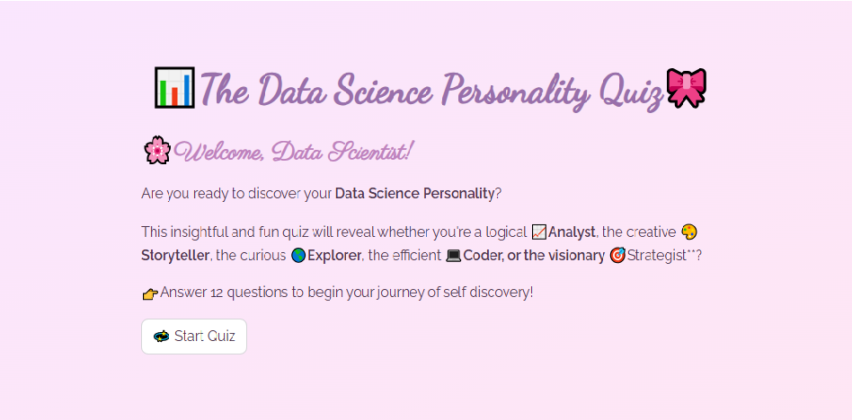
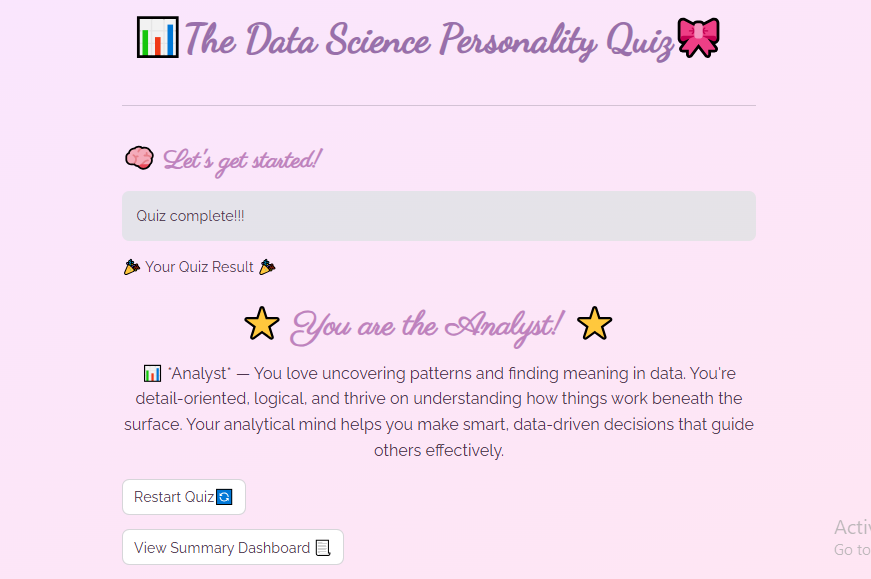

---

# 🧠 Data Science Personality Quiz

Welcome to the Data Science Personality Quiz — an interactive Streamlit app that predicts your personality type based on your answers to fun and analytical questions!

🎀 Built with Python, Machine Learning and Streamlit

---

# 💡 About the Project

This project uses **machine learning** to determine your personality type (like Analyst, Storyteller, Strategist, etc.) based on your quiz responses.
It includes:

* A beautifully styled *Streamlit UI* with a custom theme 🌸

* An introduction page with emojis and a Start button 💫

* A question-by-question quiz flow 🧩

* A result page showing your personality type and description 💬

* A separate *Summary Dashboard* with a pie chart visualizing all quiz results 📊

* A *trained ML model* (using data from personality_quiz_training_data.csv) that predicts the personality type

---

# 🎯 Machine Learning Details

* Algorithm: Random Forest Classifier

* Accuracy: 93.33%

* Trained using responses from *personality_quiz_training_data.csv* and the final trained model was saved as model.pkl

---

# 🧰 Technologies Used

* Python 🐍

* Streamlit – for the app interface

* Pandas, Scikit-learn, NumPy – for data processing and model building

* Matplotlib – for dashboard visualization

---

# 🖼 App Preview

Here's how the app looks when you launch it:

  

---

# ⭐ Personlaity Result example

After completing the quiz, you get a personalized result with a description:

  

---

# 📊 Summary Dashboard

All quiz results are summarized in a pie chart to visualize personality distribution:

  

---

# 🚀 How to Run the App

1. Clone or download this repository.

2. Make sure you have the required libraries installed:

  pip install streamlit pandas scikit-learn matplotlib

3. Run the app using:

  streamlit run app.py

4. The app will open automatically in your browser.

---

# 📂 Project Structure

📁 data_science_personality_quiz

├── app.py                                       # Main Streamlit app file  
├── train_model.py                               # Script for training and saving the model  
├── personality_quiz_training_data.csv         # Quiz data used for model training  
├── results.csv                                # Stores quiz responses and results  
├── requirements.txt                           # Required tools to run the quiz

├── model.pkl                                  # Trained machine learning model                            
└── README.md                                  # This file

---

# 🌷 Features Coming Soon

* Personalized tips for each personality type

* Option to share results on social media

* Dark mode theme

---

# 💖 Credits

Created by **Dimple Rana** with the help of Streamlit, Python, and curiosity for data ✨

---

